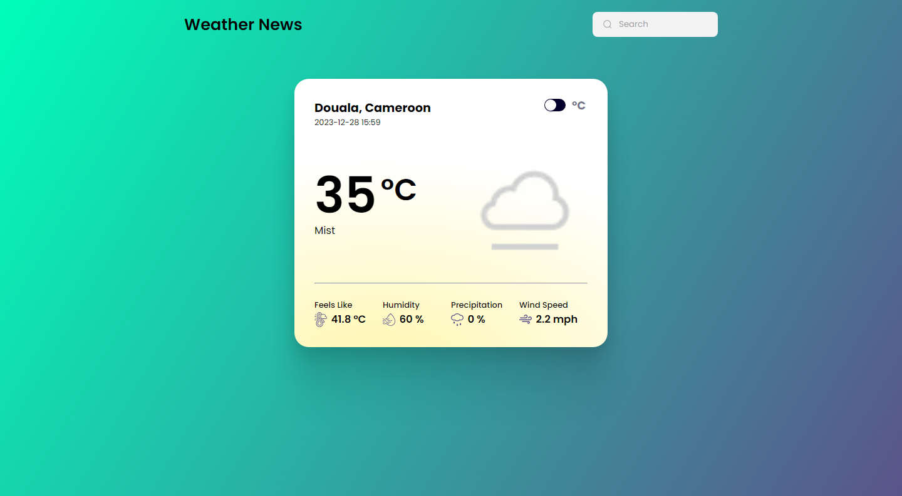

# Weather App
Weather is an assignement from The Odin Project to work with API and isplay the data on the DOM elements.

## Screenshot

## Links
[Live preview](https://odin-weatherapp-mk.vercel.app/)

## Contribution
Pull requests are welcome. For major changes, please open an issue first
to discuss what you would like to change.

## License
[MIT](https://choosealicense.com/licenses/mit/)
